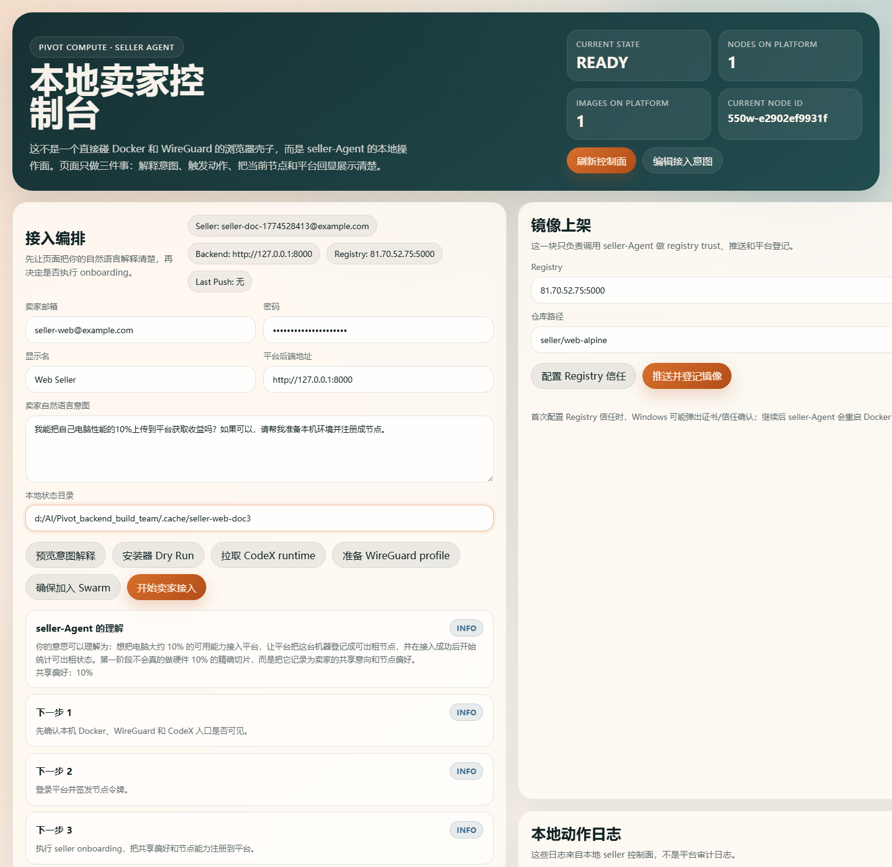
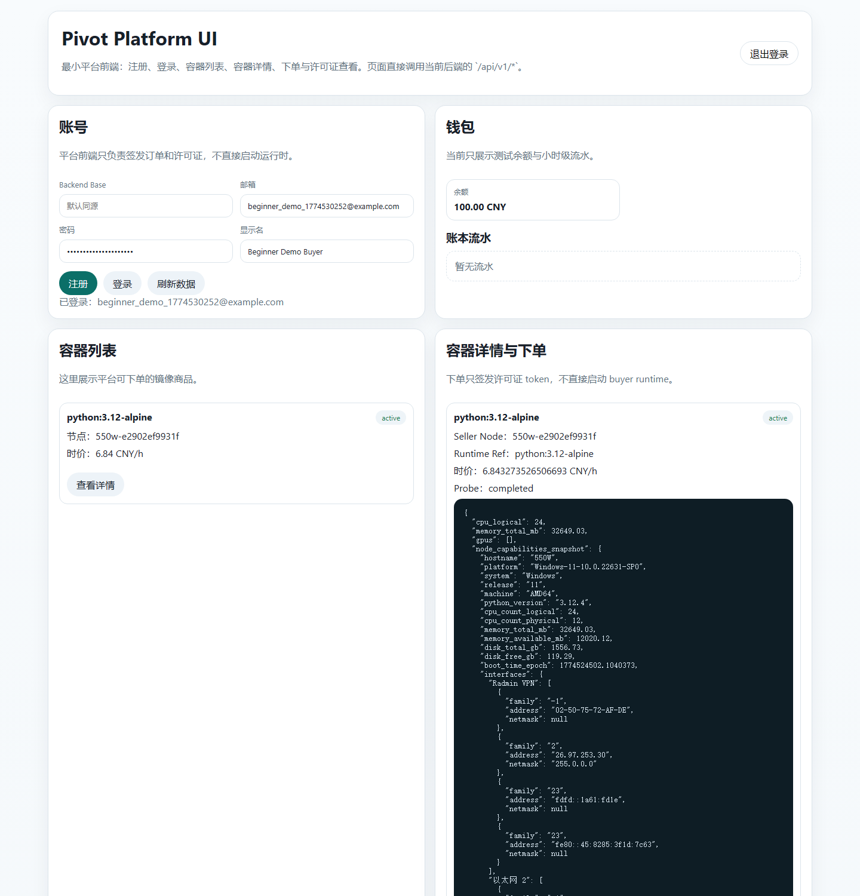
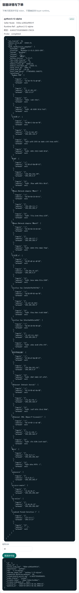
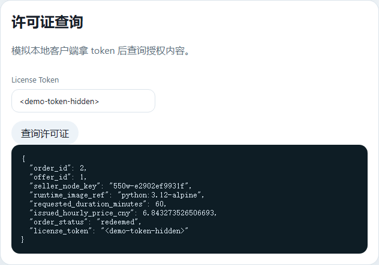
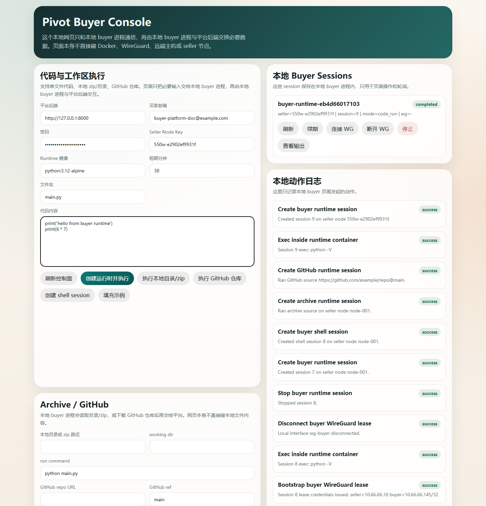
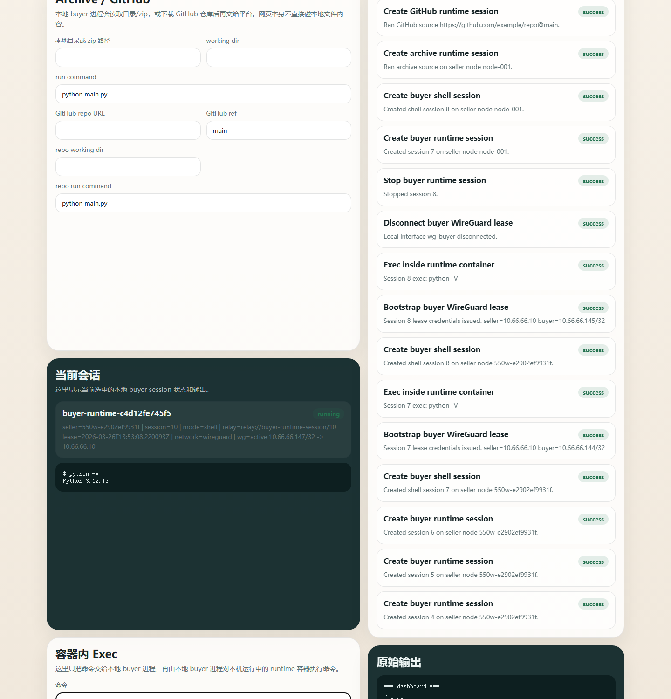

# Pivot 项目新手前端跑通文档

本文基于 `2026-03-26` 到 `2026-03-27` 在本机实际验证的结果整理，目标是让第一次接触项目的同学能按页面按钮把卖家到买家的演示链路走完，并知道哪些地方是当前产品边界，哪些地方是已知限制。

## 2026-03-27 更新

1. seller 页现在应按“一键推送并上架镜像”来讲，不再把“发布 buyer 可见商品 ImageOffer”当成额外人工步骤。
2. 平台后端会在 `/api/v1/platform/images/report` 内自动完成 probe、定价和 `ImageOffer` 发布。
3. 这一跳在真实环境里可能需要 20 到 40 秒，seller 页面点击按钮后不要重复点击，等待阶段结果返回即可。
4. 首次配置 Registry 信任时，Windows 仍可能弹出证书/信任确认窗口；允许继续后 seller-Agent 可能会重启 Docker Desktop。

## 1. 先理解这条链路

当前项目不是“一张网页点到底”的单体产品，而是两段式闭环：

1. 卖家和平台前端负责接入、上架、下单、签发许可证。
2. 买家本地前端负责真正启动 runtime、连 `wg-buyer`、执行代码和进入 shell。

也就是说：

- `http://127.0.0.1:3847/` 是本地 seller 控制台。
- `http://127.0.0.1:8000/platform-ui/` 是平台前端。
- `http://127.0.0.1:3857/` 是本地 buyer 控制台。

## 2. 启动顺序

先在仓库根目录启动后端依赖：

```powershell
docker compose up -d db redis backend
```

再分别启动 seller 和 buyer 本地网页：

```powershell
python seller_client\agent_server.py
python buyer_client\agent_server.py
```

如果 seller / buyer 页已经在跑，就不需要重复执行。

## 3. 卖家前端

打开 `http://127.0.0.1:3847/`。

如果你想直接查看我这次验证过的本机状态，把 `本地状态目录` 改成：

```text
d:/AI/Pivot_backend_build_team/.cache/seller-web-doc3
```

然后点击 `刷新控制面`。如果是第一次全新接入，按下面顺序点：

1. `预览意图解释`
2. `开始卖家接入`
3. `拉取 CodeX runtime`
4. `准备 WireGuard profile`
5. `确保加入 Swarm`

卖家接入后，你应该能看到平台节点数、镜像数、当前 node id，以及平台快照。



### 3.1 Registry 信任

滚动到 `镜像上架` 区域。

1. 先点 `配置 Registry 信任`
2. 再点 `推送并上架镜像`
3. 点击后等待返回，不要连续重复点。真实环境里平台后端会在这一步继续做 probe 和定价，通常需要 20 到 40 秒。

这里要特别注意两个现象：

- 首次点击 `配置 Registry 信任` 时，Windows 可能弹出证书/信任确认窗口。需要允许继续。
- 这个动作会重启 Docker Desktop。本机 `backend`、`db`、`redis` 可能会短暂中断。如果平台前端突然打不开，重新执行一次 `docker compose up -d db redis backend` 即可。


### 3.2 当前状态说明

`2026-03-26` 首次验证时，这台机器上确实出现过：

```text
tls: failed to verify certificate: x509: certificate signed by unknown authority
```

它的本质不是平台交易逻辑报错，而是 seller 本机的 Docker 还没有完全信任私有 Registry 的证书链。

`2026-03-27` 复查时，这个问题已经消失：seller 前端的 `推送并登记镜像` 已经能成功完成，手工 `docker push` 也能成功。

`2026-03-27` 的最新验证结果已经不是这样：seller 前端现在可以把镜像推到 Registry，并由平台后端在同一条链路里自动发布成 buyer 目录里可见的 `ImageOffer`。
这意味着演示时可以直接从 seller 页点“一键推送并上架镜像”，然后再去平台前端和 buyer 前端继续验证，不需要额外准备一个手工发布的 demo offer。

## 4. 平台前端

打开 `http://127.0.0.1:8000/platform-ui/`。

第一次演示按下面顺序点：

1. 填邮箱、密码、显示名
2. 点击 `注册`
3. 点击 `登录`
4. 登录后等待商品列表加载
5. 点击商品详情
6. 点击 `签发许可证`
7. 点击 `查询许可证`

你应该能看到：

- 钱包余额
- 可下单商品
- 商品详情里的 `Seller Node`
- 订单结果
- redeem 后的许可证结果







### 4.1 买家接下来要抄走什么

从平台前端带走两项信息：

1. `Seller Node`
2. `Runtime Ref`

在这次 demo 里，它们分别是：

```text
Seller Node: 550w-e2902ef9931f
Runtime Ref: python:3.12-alpine
```

## 5. 买家前端

打开 `http://127.0.0.1:3857/`。

把表单改成下面这些值：

- `平台后端`：`http://127.0.0.1:8000`
- `买家邮箱`：填写你刚才在平台前端注册/登录的那个账号
- `密码`：对应密码
- `Seller Node Key`：从平台商品详情复制
- `Runtime 镜像`：从平台商品详情复制，一般就是 `python:3.12-alpine`

### 5.1 单文件运行

点击 `创建运行时并执行`。

如果右侧 `当前会话` 还停在 `starting`，去右边 `本地 Buyer Sessions` 卡片上点一次 `刷新`。当前 buyer 前端不会自动持续轮询到任务结束，所以这一步对新手很重要。

成功后应该能看到代码输出：

```text
hello from buyer runtime
42
```



### 5.2 shell + WireGuard

如果想演示“买家真正进入可交互运行态”，按下面顺序点：

1. `创建 shell session`
2. 等 session 起来后点一次 `刷新`
3. `连接 wg-buyer`
4. 在命令框里保留 `python -V`
5. 点击 `在当前 session 执行命令`

成功后应该能看到：

- `wg=active`
- buyer 分到的 `wg-buyer` 地址
- `Python 3.12.13` 这样的 exec 输出



## 6. 总结话术

可以直接这么讲：

1. 卖家页负责把本机接入平台，准备 Docker、Swarm、WireGuard 和镜像上架条件。
2. 平台页负责交易闭环，也就是注册、登录、看商品、下单、拿许可证。
3. 买家页负责运行闭环，也就是根据 seller node 和 runtime image 真正起 runtime、跑代码、进 shell、接入 `wg-buyer`。

## 7. 坑

1. `配置 Registry 信任` 会弹证书确认，还会重启 Docker Desktop。
2. Docker Desktop 重启后，本机 `backend/db/redis` 可能掉线，需要重新 `docker compose up -d db redis backend`。
3. 当前 seller 前端已经能完成镜像推送，并由平台后端自动发布 `ImageOffer`；这一步可能需要等待几十秒，不要连续重复点击。
5. buyer 页在 `创建运行时并执行` 之后，如果还没看到最终输出，记得手动点一次 `刷新`。
6. 交互式命令建议用 `shell session`，不要在已经结束的一次性代码任务上再点 `exec`。
