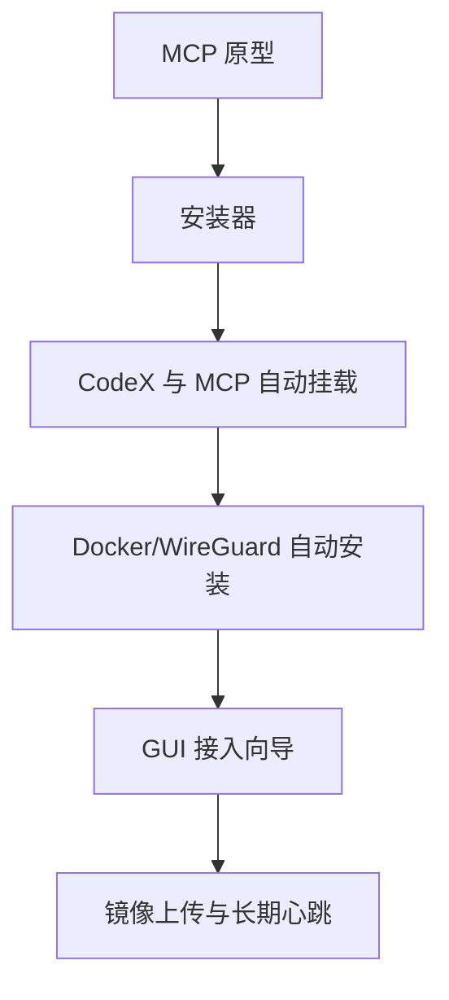

# 客户端规划

## 未来要完成

- GUI
- 安装器
- CodeX 自动安装
- MCP 自动挂载
- Docker / WireGuard 全自动安装
- registry 信任自动化
- 镜像真实上传闭环
- 后台常驻心跳与状态同步

## 当前阶段目标

- 从“本地 MCP 原型”推进到“小白卖家一键接入客户端”

## 流程图

```mermaid
flowchart TD
    A[MCP 原型] --> B[安装器]
    B --> C[CodeX 与 MCP 自动挂载]
    C --> D[Docker/WireGuard 自动安装]
    D --> E[GUI 接入向导]
    E --> F[镜像上传与长期心跳]
```
