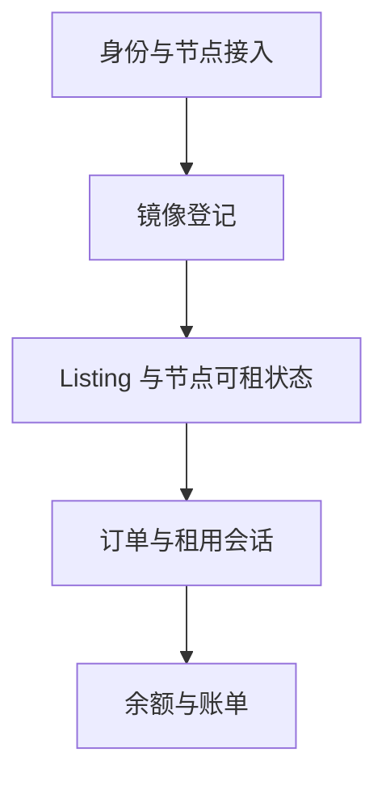

# 平台后端规划

## 未来要完成

- 钱包与余额系统
- 账单与收益台账
- 订单与租用会话
- 可租节点列表
- 镜像管理后台
- runtime service 调度指令
- 买家连接码与运行时会话
- 前端页面支持

## 当前阶段目标

- 从“身份 + 节点接入”推进到“订单 + 账单 + 状态查看”

## 流程图

```mermaid
flowchart TD
    A[身份与节点接入] --> B[镜像登记]
    B --> C[Listing 与节点可租状态]
    C --> D[订单与租用会话]
    D --> E[余额与账单]
```
