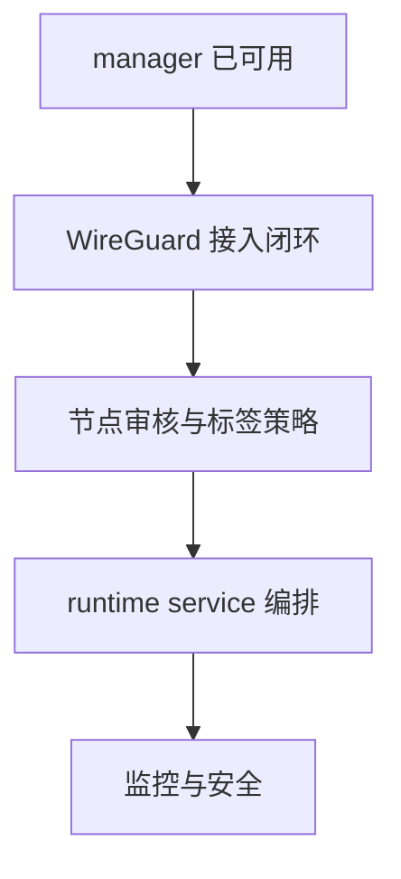

# 服务器规划

## 未来要完成

- WireGuard 节点接入闭环
- 节点审核与可用性控制
- runtime service 业务编排
- buyer runtime gateway / relay
- registry HTTPS 或信任自动化
- 监控、日志、告警
- 生产级安全加固

## 当前阶段目标

- 把 manager 从“已可用”推进到“可持续接入卖家节点”

## 流程图

