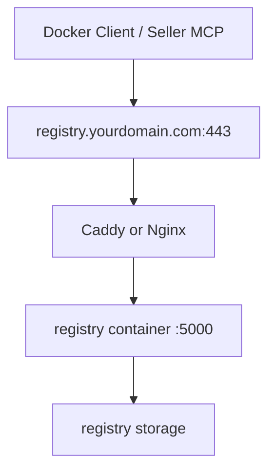

# 私有 Registry 域名与证书方案

## 目的

这份文档只解决一件事：

把当前服务器上的私有 Docker registry，从“IP + 5000 + 自签名 / 手工信任”升级成更接近阿里云、腾讯云镜像仓库的体验。

目标效果：

- 客户端上传镜像时尽量少做本地特殊配置
- Docker 默认信任 registry
- 重启电脑后仍然稳定可用
- 后续卖家客户端可以像普通云平台一样推镜像

## 当前问题

当前 registry 是：

- 服务器：`81.70.52.75`
- registry 端口：`5000`

这种形态的问题是：

- 直接 HTTP 会被 Docker 默认拒绝
- 自签名 HTTPS 需要本机额外导入 CA
- Docker Desktop 上的 `insecure-registries` 不是最稳的长期方案
- 用户体验不像云厂商镜像仓库

## 推荐方案

推荐最终形态：

- 买一个普通域名
- 为 registry 单独准备一个二级域名
- 用公网可信 CA 的 HTTPS 证书
- 外部统一走 `443`
- registry 容器内部继续跑在 `5000`
- 用 `Caddy` 或 `Nginx` 做 TLS 终止和反向代理

最终镜像地址应该长成这样：

```text
registry.yourdomain.com/seller/demo-image:tag
```

而不是：

```text
81.70.52.75:5000/seller/demo-image:tag
```

## 域名怎么选

### 最小要求

一个普通二级域名就够：

- `registry.yourdomain.com`
- `images.yourdomain.com`
- `hub.yourdomain.com`

推荐：

- 专门给 registry 单独分一个子域名
- 不建议直接用裸域名
- 不建议继续直接用 IP

### 域名记录

需要一条 `A` 记录：

- `registry.yourdomain.com -> 81.70.52.75`

如果未来有 IPv6，再补 `AAAA` 记录。

## 证书怎么选

### 推荐证书类型

普通 `DV SSL` 就够。

可以选：

- `Let's Encrypt`
- 阿里云普通 DV 证书
- 腾讯云普通 DV 证书
- Cloudflare 证书配合反代方案

### 不需要的东西

这件事不需要：

- OV 证书
- EV 证书
- 通配符证书

最小方案只要一张覆盖单个二级域名的证书：

- `registry.yourdomain.com`

## 为什么普通 SSL 就够

Docker 客户端关心的是：

- 域名是否匹配
- 证书是否由系统信任的 CA 签发

它不关心：

- 企业展示名
- EV 绿色标识
- 高等级企业认证

所以对私有 registry 来说：

- 普通 DV 证书足够
- 域名匹配正确最重要

## 服务端部署建议

### 推荐拓扑



### 推荐端口

外部：

- `443/tcp`

内部：

- registry 容器继续监听 `5000`

### 为什么推荐 443

- 更接近云厂商体验
- Docker 客户端默认 HTTPS 逻辑更顺
- 用户更少踩坑
- 以后前端 / API / registry 统一走标准 TLS 入口更容易管理

## Caddy / Nginx 的角色

推荐在 registry 前面放一个反向代理。

它负责：

- 申请和续签 HTTPS 证书
- 对外监听 `443`
- 把请求转发到本地 registry `5000`

### 推荐优先级

如果你想少折腾：

- 优先 `Caddy`

原因：

- 自动申请 `Let's Encrypt`
- 自动续期
- 配置比 `Nginx` 更省事

如果你更熟悉传统运维：

- 用 `Nginx` 也没问题

## 服务器侧还需要什么

除了域名和证书，服务器还要确认：

- `443/tcp` 已开放
- `5000` 可以只对本机开放，不一定继续对公网暴露
- registry 数据卷已保留
- DNS 已指向 `81.70.52.75`

可选增强：

- 给 registry 加基础认证
- 给卖家客户端发只读 / 只写权限凭证
- 后续再加镜像命名规范

## 最终用户体验目标

理想状态下，卖家客户端不再需要：

- 手工导入证书
- 配置 `insecure-registries`
- 关心 registry 是 HTTP 还是 HTTPS

而只需要：

- 登录平台
- 由 MCP 自动完成镜像推送

## 购买建议

你现在去买域名时，只需要满足下面几点：

- 一个普通域名即可
- 能自由创建二级域名
- 能自己改 DNS 解析

买完后最少准备：

- 主域名：任意
- 二级域名：`registry.<your-domain>`

## 推荐下一步

买完域名后，下一步按这个顺序做：

1. 配置 `A` 记录到 `81.70.52.75`
2. 在服务器部署 `Caddy` 或 `Nginx`
3. 让 `registry.yourdomain.com:443` 反代到本机 `5000`
4. 用公网可信证书跑通 `docker login` / `docker push`
5. 再把客户端 MCP 默认推送地址改成域名 registry

## 一句话结论

最适合你的方案不是继续折腾：

- `81.70.52.75:5000`
- 自签名证书
- 本地手工导证书

而是尽快升级成：

- `registry.yourdomain.com`
- 普通 DV SSL
- 标准 HTTPS 443
- 反向代理到 registry 容器
